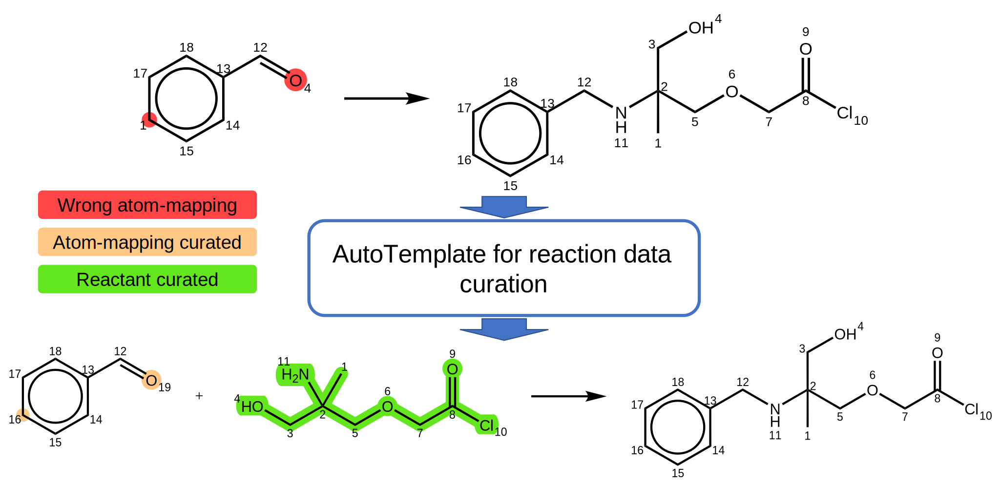

# AutoTemplate: automatically reaction data curation using reaction template
This is a data-preprocess tool that curates the reaction SMILES.

The manuscript of this repository is in preparation.



The experimental results for selected Reaxys dataset is:


## Installation
1. `git clone https://github.com/Lung-Yi/AutoTemplate.git`
2. `cd AutoTemplate`
3. `pip install rxnmapper`
4. `pip install rdchiral`
5. `pip install CGRTools`
6. `conda install -c anaconda networkx`
7. `conda install -c anaconda pandas`
8. `pip install openpyxl`
9. `conda install -c conda-forge matplotlib`
10. `pip install py-mini-racer`


## Preprocess the Reaxys dataset
### 1. Prepare the dataset
Check all the directories in ./data_reaxys/

All types of the reaction have their corresponding Reaction ID recoreds in the (.txt) files. Please download the reaction condition files (.xlsx) on https://www.reaxys.com/#/search/quick

### 2. Preprocess the dataset
(1) use RXNMapper for atom-mapping
set the RXN variable for preprocess reaction: `RXN=AdamsDecarboxylation`
```
python rxnmapper_mapping.py --input_dir data_reaxys/${RXN} \
    --output_file data/${RXN}/MappingResult_${RXN}.txt
```

(2) extract super general reaction templates and apply them on the original reaction
```
python auto_process.py \
    --input_file data/${RXN}/MappingResult_${RXN}.txt \
    --radius 0 \
    --threshold 5
```

(3) use PubChem and ChemSpider to double check the chemical names and emerge the names and smiles:
1. `cd rxn_yield_context/preprocess_data`
2. `python emerge.py --input_dir ../../data/reaxys_output_local/unprocessed_class --output_dir ../../data/reaxys_output_local/label_processed`
3. `python manually_modify.py --target_dir ../../data/reaxys_output_local/label_processed`

## Examine the preprocessed results.
```
python post_analysis.py
```

## Super general reaction template extraction tutorial
For further details about the reaction template extraction, please refer to:

scripts/examples.ipynb