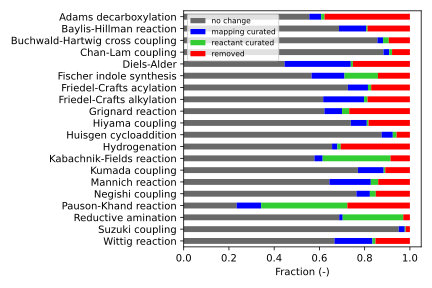

# AutoTemplate: automatically reaction data curation using reaction template
This is a data-preprocess tool that curates the reaction SMILES.

The manuscript of this research can be freely accessed on:
https://jcheminf.biomedcentral.com/articles/10.1186/s13321-024-00869-2


The experimental results for selected Reaxys dataset is:



## Installation
1. `git clone https://github.com/Lung-Yi/AutoTemplate.git`
2. `conda create --name autotemplate python=3.7`
3. `conda activate autotemplate`
4. `pip install rxnmapper`
5. `pip install rdchiral`
6. `pip install CGRTools`
7. `conda install -c anaconda networkx`
8. `conda install -c anaconda pandas`
9. `pip install openpyxl`
10. `conda install -c conda-forge matplotlib`
11. `pip install py-mini-racer`

Alternatively, you can choose to install the environment by the .yml file:
```
conda env create -f docs/environment.yml
```

## Preprocess the Reaxys dataset
### 1. Prepare the dataset
Check all the directories in ./data_reaxys/

All types of the reaction have their corresponding Reaction ID records in the (.txt) files. Please download the files (.xlsx) on https://www.reaxys.com/#/search/quick

### 2. Preprocess the dataset
(1) use RXNMapper for atom-mapping
set the RXN variable for preprocess reaction: `RXN=AdamsDecarboxylation`
```
python rxnmapper_mapping.py --input_dir data_reaxys/${RXN} \
    --output_file data/${RXN}/MappingResult_${RXN}.txt
```

(2) extract generic reaction templates and apply them on the original reaction
```
python auto_process.py \
    --input_file data/${RXN}/MappingResult_${RXN}.txt \
    --radius 0 \
    --threshold 5 --ncpus 1
```
NOTE(1): The default preprocessing function would remove the spectator molecules (help conduct the reaction but do not contribute any atom) in processed reaction SMILES. To keep those molecules in processed reaction SMILES, please add the argument in the above script: `--retain_reagents`.

NOTE(2): If you want to empirically retain the leaving group molecule in the position of the reaction product, please include this argument (but this method merely substitutes the leaving group with hydrogen and may not necessarily yield the correct chemical product): `--balance_product`.

NOTE(3): We recommend using multiple cpu to accelerate the data preprocessing. Please change this argument: `--ncpus`.

## Examine the preprocessed results.
```
python post_analysis.py
```

## Generic reaction template extraction tutorial
For further details about the reaction template extraction, please refer to:

scripts/examples.ipynb

## Citation
If you find this work useful, please cite this paper:
```
@article{Chen2024autotemplate,
   author = {Chen, Lung-Yi and Li, Yi-Pei},
   title = {AutoTemplate: enhancing chemical reaction datasets for machine learning applications in organic chemistry},
   journal = {Journal of Cheminformatics},
   volume = {16},
   number = {1},
   pages = {74},
   ISSN = {1758-2946},
   DOI = {10.1186/s13321-024-00869-2},
   url = {https://doi.org/10.1186/s13321-024-00869-2},
   year = {2024},
   type = {Journal Article}
}
```